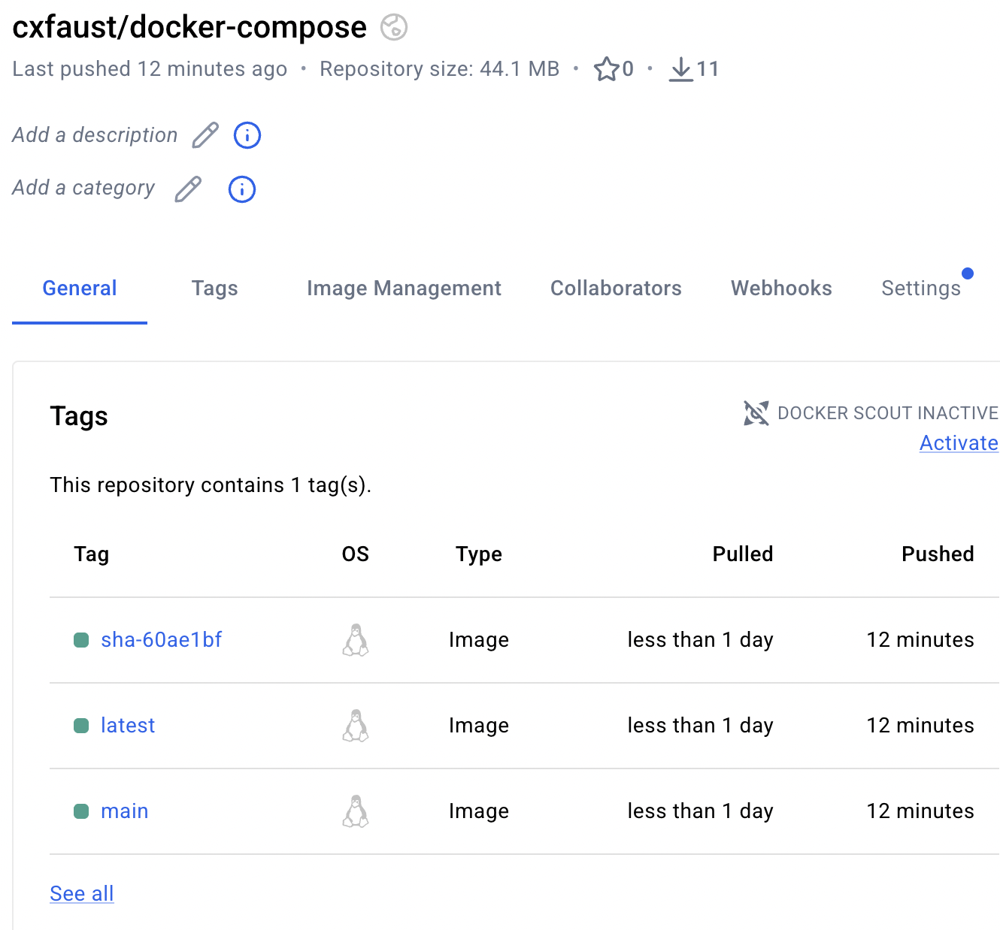
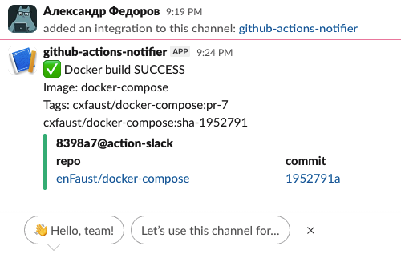

# Docker Build Automation with GitHub Actions

## Overview
This project demonstrates automated Docker image building and publishing using GitHub Actions and a multi-stage Dockerfile.
A simple Python application is containerized, built, and deployed to Docker Hub, with Slack notifications sent on build success or failure.

## CI/CD Automation (GitHub Actions)
The GitHub Actions workflow:

Builds the Docker image using a multi-stage Dockerfile
Tags the image automatically
Pushes the image to Docker Hub

Sends Slack notifications on success or failure

